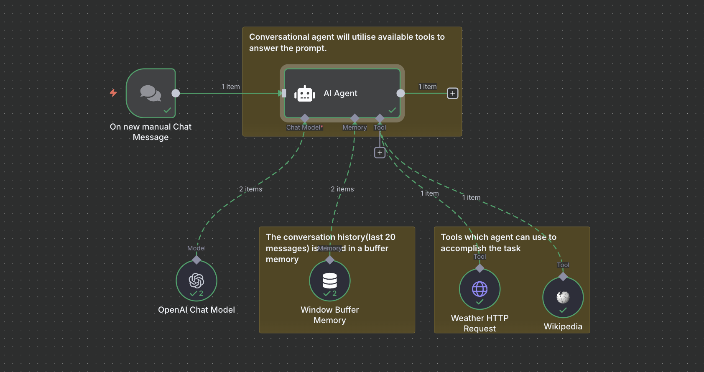

## Weather + Wikipedia Agent (n8n)

This workflow implements a simple conversational agent that can answer:
- current weather and 1-day hourly temperature forecast using Open-Meteo
- general background questions using Wikipedia

### What is inside
- Manual chat trigger to start a conversation
- AI Agent with a system prompt that routes to tools
- OpenAI chat model (`gpt-4.1-mini`)
- Window buffer memory (last 20 messages)
- Tools:
  - Wikipedia tool
  - HTTP tool to Open-Meteo (`https://api.open-meteo.com/v1/forecast`)

### Requirements
- n8n with LangChain nodes installed
- OpenAI API credentials configured in n8n
- Internet access for Wikipedia and Open-Meteo

### How to use
1. Import `WeatherAgent.json` into n8n.
2. Set the OpenAI credentials on the `OpenAI Chat Model` node.
3. Run the workflow and use the manual chat trigger.
4. Ask for weather by location (the agent will resolve lat/long and call Open-Meteo).
5. Ask general info questions and it will use Wikipedia.

### Notes
- Weather requests use `forecast_days=1` and `hourly=temperature_2m`.
- The agent keeps a rolling window of 20 recent messages.
