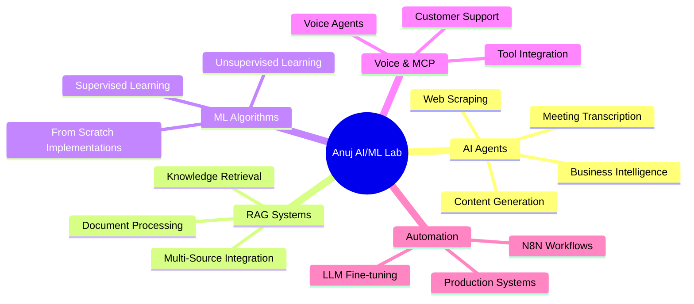
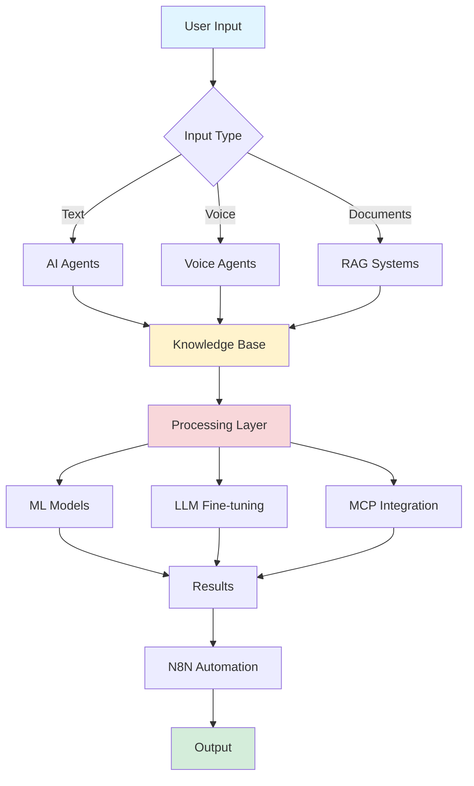

<div align="center">

# Anuj AI/ML Lab

### *Your Gateway to Production-Ready AI Systems*

[](https://github.com)
[](https://www.python.org/)
[](LICENSE)
[](https://github.com)
[](https://github.com)


---

### A comprehensive collection of AI agents, RAG applications, and machine learning algorithms built from the ground up

[Quick Start](#quick-start) • [Documentation](#project-categories) • [Contributing](#contributing) • [Star Us](#)

</div>

---

## Table of Contents

- [Overview](#overview)
- [Key Features](#key-features)
- [System Architecture](#system-architecture)
- [Project Categories](#project-categories)
- [Quick Start](#quick-start)
- [LLM Projects (Submodules)](#llm-projects-submodules)
- [Usage Examples](#usage-examples)
- [Contributing](#contributing)
- [License](#license)

---

## Overview

<div align="center">



</div>

Welcome to **Anuj AI/ML Lab** - a comprehensive learning resource and development playground for building cutting-edge AI systems. This repository bridges the gap between theory and practice, offering production-ready implementations alongside educational resources.

> **Active Development**: This repository undergoes frequent updates with new features and improvements.
> **Star & Fork** this repo to stay updated and experiment with your own modifications!

---

## Key Features

<table>
<tr>
<td width="50%">

### **AI Agents**
- Content generation pipelines
- Intelligent web scraping
- Meeting transcription systems
- Business intelligence agents
- Multi-modal integrations (Gmail, YouTube, PDF)

</td>
<td width="50%">

### **RAG Applications**
- Advanced retrieval systems
- Document processing pipelines
- Knowledge base management
- Context-aware responses
- Multi-source data integration

</td>
</tr>
<tr>
<td width="50%">

### **ML From Scratch**
- Supervised learning algorithms
- Unsupervised learning methods
- Educational implementations
- Performance benchmarks
- Visualization tools

</td>
<td width="50%">

### **Voice & MCP Agents**
- Voice-powered AI assistants
- Customer support automation
- Model Context Protocol integration
- External tool connectivity
- Real-time interactions

</td>
</tr>
</table>

---

## System Architecture

<div align="center">



**Architecture Flow**: Input → Processing → Knowledge Base → Model Execution → Automation → Output

</div>

---

## Project Categories

<details open>
<summary><b>AI Agents</b> - Click to expand</summary>

| Agent Type | Description | Tech Stack |
|------------|-------------|------------|
| Content Generation | Automated content creation systems | LangChain, OpenAI |
| Web Scraping | Intelligent data extraction agents | Playwright, BeautifulSoup |
| Meeting Transcription | Audio-to-text conversion with AI summaries | Whisper, GPT-4 |
| Business Intelligence | Data analysis and reporting agents | Pandas, Plotly |
| LLM Applications | Chat with Gmail, YouTube, PDFs, and more | RAG, Vector DBs |

</details>

<details open>
<summary><b>RAG Applications</b> - Click to expand</summary>

Advanced retrieval-augmented generation implementations for:
- Document processing and indexing
- Semantic search and retrieval
- Context-aware question answering
- Knowledge base management
- Multi-source data integration

</details>

<details open>
<summary><b>Machine Learning Algorithms</b> - Click to expand</summary>

From-scratch implementations for educational purposes:
- **Supervised Learning**: Linear/Logistic Regression, Decision Trees, SVM, Neural Networks
- **Unsupervised Learning**: K-Means, PCA, Hierarchical Clustering
- **Deep Learning**: CNNs, RNNs, Transformers (basic implementations)
- **Optimization**: Gradient Descent, Adam, RMSprop

</details>

<details>
<summary><b>Fine-Tuning Projects</b> - Click to expand</summary>

LLM fine-tuning implementations:
- LoRA (Low-Rank Adaptation)
- Domain-specific adaptations
- Parameter-efficient fine-tuning
- Training pipelines and evaluation

</details>

<details>
<summary><b>Voice Agents</b> - Click to expand</summary>

Voice-powered AI systems:
- Customer support automation
- Web interaction via voice
- Real-time speech processing
- Text-to-speech integration

</details>

<details>
<summary><b>MCP Agents</b> - Click to expand</summary>

Model Context Protocol implementations:
- External tool integration
- API connectivity
- Multi-agent collaboration
- Real-time data streaming

</details>

<details>
<summary><b>N8N Automation</b> - Click to expand</summary>

Workflow automation configurations:
- AI-powered process automation
- Email and notification workflows
- Scheduled tasks
- System integrations

</details>

---

## Quick Start

### Prerequisites

```bash
# Python 3.8 or higher
python3 --version

# pip package manager
pip3 --version
```

### Installation Steps

<table>
<tr>
<td>

**Step 1: Clone the Repository**
```bash
git clone https://github.com/yourusername/Anuj-AI-ML-Lab.git
cd Anuj-AI-ML-Lab
```

</td>
</tr>
<tr>
<td>

**Step 2: Navigate to Project**
```bash
cd <project_folder>
```

</td>
</tr>
<tr>
<td>

**Step 3: Install Dependencies**
```bash
python3 -m pip install -r requirements.txt
```

</td>
</tr>
<tr>
<td>

**Step 4: Follow Project README**
```bash
# Each project has specific setup instructions
cat README.md
```

</td>
</tr>
</table>

---

## LLM Projects (Submodules)

<div align="center">

| Project | Description | Status |
|---------|-------------|--------|
| [AIExpense-ManagementSystem](LLM_PROJECTS/AIExpense-ManagementSystem) | AI-powered expense tracking and management platform | Active |
| [DailyNews_IncrementalModel](LLM_PROJECTS/DailyNews_IncrementalModel) | Incremental learning for news intelligence systems | Active |
| [Multi-agent-orchestrator-system](LLM_PROJECTS/Multi-agent-orchestrator-system-with-standardized-A2A-Protocol) | Multi-agent orchestration with A2A protocol | Active |

</div>

---

## Usage Examples

### Running Streamlit Applications

```bash
# Interactive web applications
streamlit run <app_file>.py

# Example: RAG chat application
streamlit run rag_chat_app.py
```

### Running Python Scripts

```bash
# Command-line utilities
python3 <script_file>.py

# Example: ML training script
python3 train_model.py --config config.yaml
```

### Project-Specific Configuration

| Configuration Type | Description |
|-------------------|-------------|
| **Dependencies** | Each project includes `requirements.txt` |
| **Browser Automation** | Playwright projects need additional setup |
| **MCP Agents** | Require configuration files (see docs) |
| **API Keys** | Store in `.env` files (see `.env.example`) |

---

## Contributing

<div align="center">

We welcome contributions from the community!

[](CONTRIBUTING.md)

</div>

### How to Contribute

1. Fork the repository
2. Create a feature branch (`git checkout -b feature/AmazingFeature`)
3. Commit your changes (`git commit -m 'Add some AmazingFeature'`)
4. Push to the branch (`git push origin feature/AmazingFeature`)
5. Open a Pull Request

See [CONTRIBUTING.md](CONTRIBUTING.md) for detailed guidelines.

---

## License

This project is licensed under the terms specified in the [LICENSE](LICENSE) file.

---

<div align="center">

### Show Your Support

If you find this project useful, please consider giving it a star!

[](https://star-history.com/#yourusername/Anuj-AI-ML-Lab&Date)

---

**Made with care by Anuj** | [GitHub](https://github.com) | [LinkedIn](https://linkedin.com) | [Twitter](https://twitter.com)

</div>
