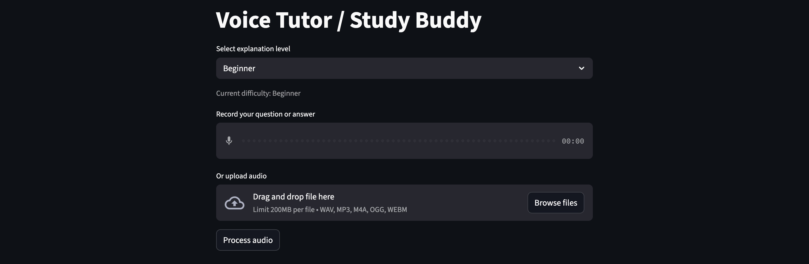

# Voice Tutor / Study Buddy



> **Part of [Anuj-AI-ML-Lab](https://github.com/Anujpatel04/Anuj-AI-ML-Lab)** - A focused collection of AI/ML agents, LLM apps, and practical demos.

A minimal voice-based AI tutor built with Streamlit. It explains a topic, asks one follow-up question, and adapts difficulty based on the user's spoken answer.

## Features

- **Voice Input**: Record or upload audio questions and answers
- **Whisper STT**: Transcribes spoken audio to text
- **Adaptive Difficulty**: Beginner → Intermediate → Advanced based on response quality
- **Single Follow-up**: Asks exactly one follow-up question
- **Voice Output**: Synthesizes responses using lightweight TTS (gTTS)

## Prerequisites

- Python 3.10+
- OpenAI API key

## Installation

```bash
cd VOICE_AGENTS/VoiceTutor_Agent
python3 -m venv .venv
source .venv/bin/activate
pip install -r requirements.txt
```

## Configuration

Add your API key to the root `.env` file:

```env
OPENAI_API_KEY=your-openai-api-key
```